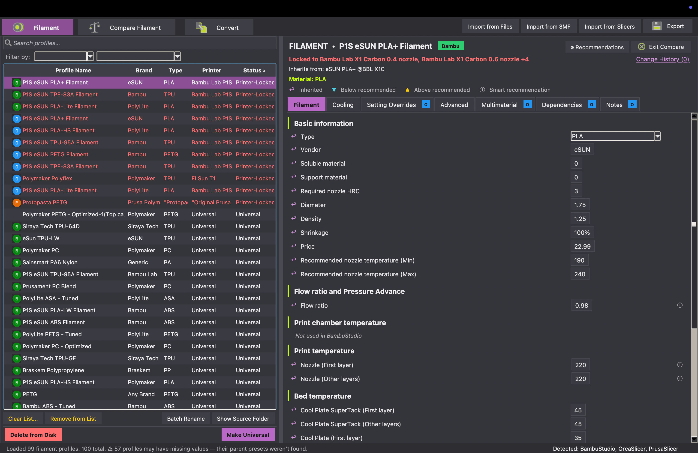
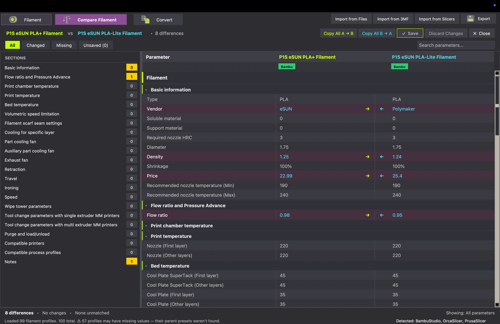
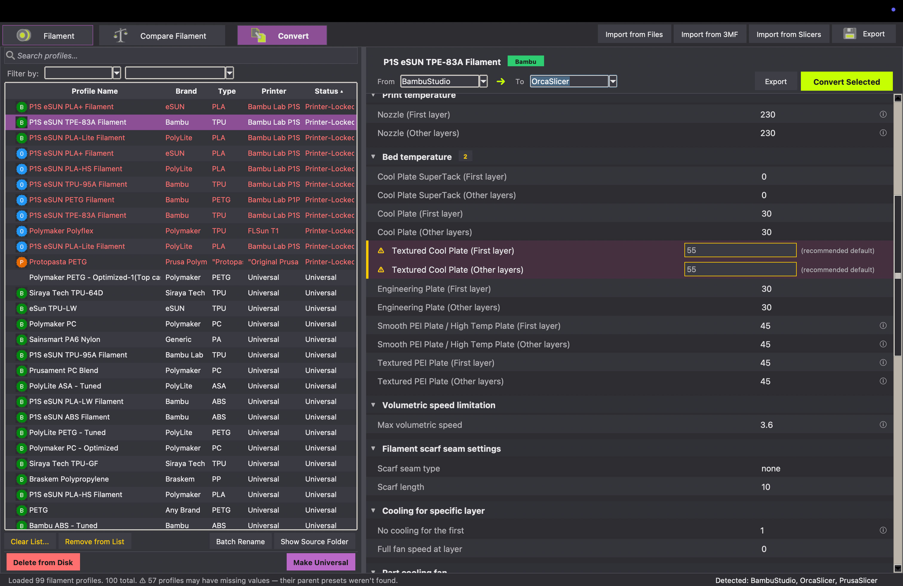
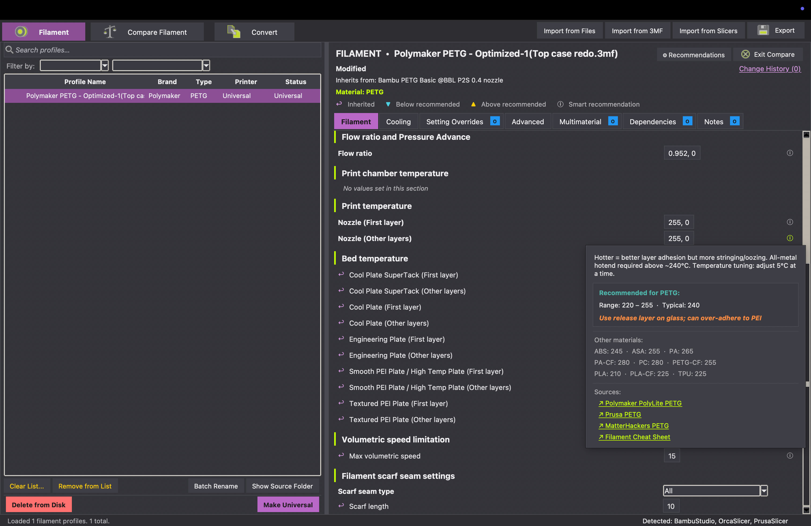
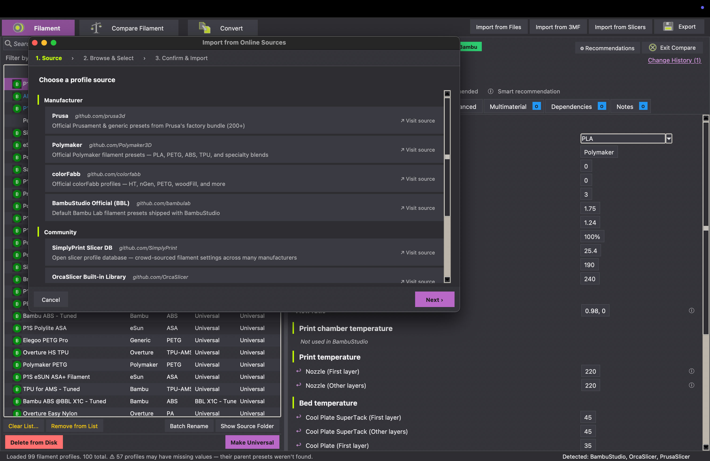
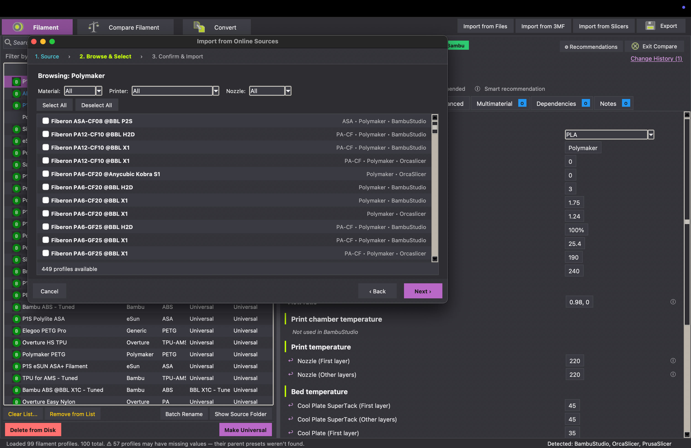

# Profile Toolkit

Desktop app for wrangling 3D printer slicer profiles. Import, edit, compare, convert, and export filament and process profiles for BambuStudio, OrcaSlicer, and PrusaSlicer. Runs locally. No account, no cloud.

**[Download for macOS (v0.1)](dist/ProfileToolkitv01.zip)** - unzip, drag to Applications.

*Windows binary coming soon.*

---

## Features

Works with BambuStudio, OrcaSlicer, and PrusaSlicer. Auto-detects installed slicers and their preset folders.

- **Unlock profiles** - make any profile usable on any printer
- **Compare** - two profiles side by side (show everything, changes only, or missing only), per-section counts, copy values between them with undo
- **Convert** - map profiles between PrusaSlicer and BambuStudio/OrcaSlicer, flags anything that didn't map cleanly
- **Import** - JSON, INI, `.3mf` (extracts the embedded filament/process profiles), installed-slicer system presets, or straight from online sources
- **Inline editing** - type-aware, full undo, per-profile change history
- **Batch rename** - find/replace and pattern tokens across a bunch of profiles at once
- **Recommendations** - flags values outside typical ranges for the material across 50+ parameters, with sources
- **Export** - JSON or INI, or drop it directly into a slicer's preset folder

---

## Screenshots

### Filament browser & editor

Every filament profile on your machine in one list. Filter by printer, brand, material, or lock status. Edit any param inline. Locked profiles, mods, and missing values are color-coded. Right pane matches BambuStudio's tab/section layout exactly.

### Side-by-side compare

Compare two profiles side by side. Three view modes (everything / changed / missing). The left panel shows a count per section so you know where the differences are. One-click **Copy A -> B** / **Copy B -> A**, undo works.

### Cross-slicer convert

Translate profiles between BambuStudio, OrcaSlicer, and PrusaSlicer. Anything that couldn't be mapped cleanly gets flagged with a warning and a recommended default so you can fix it before export.

### Smart recommendations

Hover a param to see typical ranges for the selected material, what other materials use, and where the numbers came from (Polymaker, Prusa, MatterHackers, etc). Out-of-range values get flagged in the header.

### Import from online sources

Pull profiles from manufacturer and community repos. No manually hunting down files.

**Step 1 - pick a source:** Prusa, Polymaker, colorFabb, BambuStudio Official, SimplyPrint DB, OrcaSlicer built-in, and more.

**Step 2 - browse & select:** Filter by material, printer, nozzle size. Multi-select and import.

